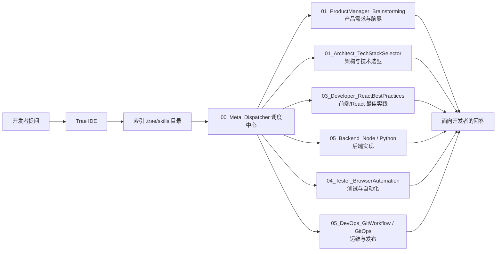

# TraeSkill

<p align="center">
  
  
  
</p>

<h1 align="center">🚀 TraeSkill</h1>

<p align="center">
  <strong>专为 Trae IDE 打造的 AI 技能与上下文增强库</strong>
</p>

<p align="center">
  <a href="#-快速开始">快速开始</a> •
  <a href="#-技能目录">技能目录</a> •
  <a href="#-使用示例">使用示例</a> •
  <a href="#-更多信息">更多信息</a>
</p>

***

## ✨ 项目简介

TraeSkill 是一个标准化的 **AI 技能集合**，为 Trae IDE 的 `.trae/skills` 机制设计。

**它的目标是**：把「行业最佳实践」沉淀为可复用的 Skill，让 AI 在 Trae 中扮演专业角色——产品经理、架构师、前端工程师、后端开发者、测试专家、SEO 专家等。

***

## � 工作原理

### TraeSkill 在 Trae IDE 中的工作流



### Skill 分类概览（按生命周期分组）

```mermaid
flowchart TB
    Core[TraeSkill 核心 Skill<br/>.trae/skills] --> Product[产研设计<br/>00/01/02 开头]
    Core --> Dev[前后端开发<br/>03/05 开头]
    Core --> QAOps[测试与运维<br/>04/05 开头]
    Core --> SEO[增长与 SEO<br/>06 开头]
    Core --> Docs[文档自动化<br/>06_Office_Docx]

    Product --> P1[00_Meta_Dispatcher<br/>需求拆解与调度]
    Product --> P2[01_ProductManager_Brainstorming]
    Product --> P3[01_Architect_TechStackSelector / 02_Architect_APIDesign]
    Product --> P4[02_Designer_UIUXIntelligence / WebGuidelines]

    Dev --> D1[03_Developer_ArtifactsBuilder / ReactBestPractices]
    Dev --> D2[03_Mobile_Flutter]
    Dev --> D3[05_Backend_Node / Python / Database]

    QAOps --> Q1[04_Tester_BrowserAutomation]
    QAOps --> Q2[05_DevOps_GitWorkflow / GitOps]

    SEO --> S1[06_SEO_ContentStrategy<br/>内容策略]
    SEO --> S2[06_SEO_Technical<br/>技术优化]
    SEO --> S3[06_SEO_Analytics<br/>数据分析]
    SEO --> S4[06_SEO_LinkBuilding<br/>外链建设]

    Docs --> Doc1[06_Office_Docx]
```



***

## �🚀 快速开始

### 方式一：复制到你的项目中

```bash
git clone https://github.com/boshi-xixixi/TraeSkill.git
```

在 Trae 中clone此仓库，AI 会自动索引到本项目中的 ./trae/skills 中的文件。

### 方式二：全局配置 skill

将下载好的这个 skill 放到你的用户名下的 Trae 目录的 skill 的目录下即可，Trae 会自动索引到这个目录下的所有文件。（可以在设置中"规则和技能"中查看）

***

## 🧩 技能目录

### 🧠 产品与设计 `00-02`

|  编号 | 技能                             | 说明                  |
| :-: | :----------------------------- | :------------------ |
|  00 | `Meta_Dispatcher`              | 任务调度与需求拆解           |
|  01 | `ProductManager_Brainstorming` | 需求头脑风暴与 PRD 生成      |
|  01 | `Architect_TechStackSelector`  | 技术栈选型与评估            |
|  02 | `Architect_APIDesign`          | REST/GraphQL API 设计 |
|  02 | `Designer_UIUXIntelligence`    | UI/UX 智能知识库         |
|  02 | `Designer_WebGuidelines`       | Web 设计规范审查          |

### 💻 开发 `03-05`

|  编号 | 技能                             | 说明                  |
| :-: | :----------------------------- | :------------------ |
|  03 | `Developer_ReactBestPractices` | React/Next.js 性能优化  |
|  03 | `Developer_ArtifactsBuilder`   | 前端组件快速构建            |
|  03 | `Mobile_Flutter`               | Flutter 架构与性能       |
|  03 | `Mobile_FlutterChinaDeploy`    | Flutter 中国镜像加速      |
|  05 | `Backend_Node`                 | Node.js 后端模式        |
|  05 | `Backend_Python`               | Python/FastAPI 最佳实践 |
|  05 | `Backend_Database`             | SQL 优化与数据库设计        |
|  05 | `Backend_MCPBuilder`           | MCP Server 构建       |

### 🛡️ 质量与运维 `04-05`

|  编号 | 技能                         | 说明          |
| :-: | :------------------------- | :---------- |
|  04 | `Tester_BrowserAutomation` | 浏览器自动化测试    |
|  04 | `Tester_WebAppTesting`     | Web 应用测试    |
|  05 | `DevOps_GitWorkflow`       | Git 工作流规范   |
|  05 | `DevOps_GitOps`            | GitOps 部署实践 |
|  05 | `DevOps_GiteeWorkflow`     | Gitee 自动化   |

### 📈 增长与 SEO `06`

|  编号 | 技能                    | 说明            |
| :-: | :-------------------- | :------------ |
|  06 | `SEO_ContentStrategy` | SEO 内容策略规划    |
|  06 | `SEO_Technical`       | 技术 SEO 优化     |
|  06 | `SEO_Analytics`       | SEO 数据分析与 ROI |
|  06 | `SEO_LinkBuilding`    | 外链建设与社交 SEO   |

### 📄 办公自动化 `06`

|  编号 | 技能             | 说明          |
| :-: | :------------- | :---------- |
|  06 | `Office_Docx`  | Word 文档处理   |
|  06 | `Office_Excel` | Excel 数据分析  |
|  06 | `Office_Pdf`   | PDF 处理与表单填写 |

### 🤖 AI 与安全 `07-08`

|  编号 | 技能                    | 说明                 |
| :-: | :-------------------- | :----------------- |
|  07 | `Security_Specialist` | 安全审计与 GDPR         |
|  08 | `AI_Engineer`         | RAG 与 LangChain 架构 |

### 🚀 运营 `09`

|  编号 | 技能                  | 说明             |
| :-: | :------------------ | :------------- |
|  09 | `Operations_Growth` | 内容创作、数据分析、营销活动 |

### ⚙️ 元技能 `99`

|  编号 | 技能                      | 说明       |
| :-: | :---------------------- | :------- |
|  99 | `Meta_SkillCreator`     | 创建新技能    |
|  99 | `Meta_Customization`    | 用户偏好设置   |
|  00 | `Meta_UniversalDevTeam` | 全能开发团队编排 |

***

## 🌟 能力覆盖

TraeSkill 覆盖了从"想做什么"到"如何上线"的完整软件开发生命周期：

- 🧠 **Product & Design**：PRD 生成、需求澄清、用户故事拆解、设计系统
- 🏗 **Architecture & Backend**：系统边界划分、接口设计、数据库建模、Node.js/Python 后端
- 💻 **Frontend & Mobile**：React 性能优化、Flutter 架构、移动端开发
- 🛡 **Quality & Operations**：浏览器自动化测试、安全审计、Git 工作流、CI/CD
- 📈 **Growth & SEO**：内容策略、技术 SEO、数据分析、外链建设
- 📄 **Office Automation**：Word/Excel/PDF 文档处理
- 🤖 **AI Engineering**：RAG、LangChain、提示词优化

***

## 📝 使用示例

### 🎯 产品需求

> "我想做一个个人笔记 App，帮我梳理需求"

### 🏗 架构设计

> "为这个笔记 App 设计 RESTful API"

### 💻 前端开发

> "用 React 和 Tailwind 写一个笔记编辑器组件"

### ⚙️ 后端实现

> "用 FastAPI 实现笔记的 CRUD 接口"

### 🧪 测试验证

> "为笔记创建流程写一个 Playwright 测试"

### 📊 SEO 优化

> "帮我分析这个落地页的 SEO 问题"

***

## 🔗 更多信息

| 文档 | 说明 |
|:---|
| [使用指南](./Trae_Skills_使用指南.md) | 详细的技能使用说明 |
| [开发技能场景指南](./开发常用技能及场景指南.md) | 按场景分类的技能索引 |

***

## 📜 许可证

<p align="center">
  
</p>

<p align="center">
  Made with ❤️ for the Trae Community
</p>
